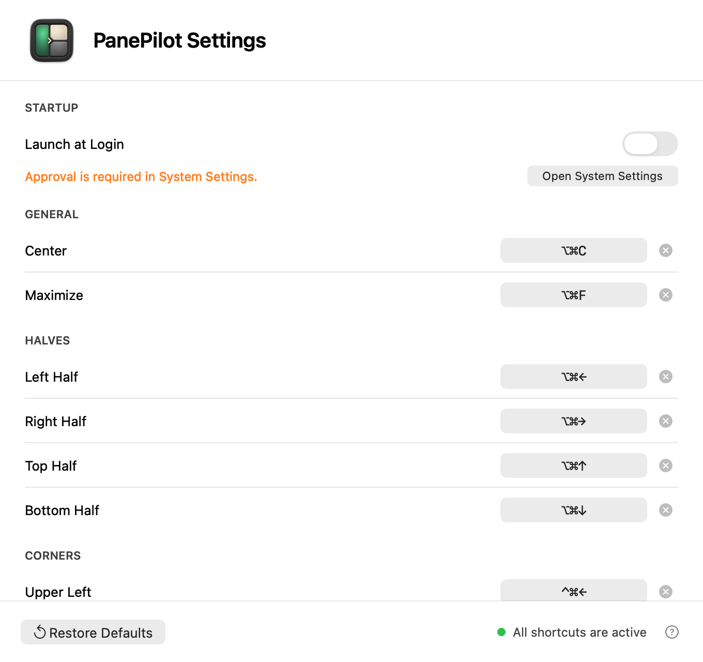

# UI Guidelines

本文档维护 AI Workspace 的界面与交互规则。当前项目尚未绑定具体前端技术栈，因此这里先定义设计文档应覆盖的稳定维度。

## 体验目标

1. 让人和 agent 都能快速找到项目事实源。
2. 让产品、设计、技术、测试、验证文档边界清晰。
3. 让新增文档时有明确入口和模板，减少格式漂移。

## 信息架构

| 层级 | 用途 |
|---|---|
| 根目录入口 | 给新会话和新读者快速定位上下文 |
| `docs/` 总入口 | 解释文档域和维护原则 |
| 领域目录 README | 说明该目录边界和索引 |
| 具体文档 | 承载可维护事实、方案、证据或模板 |

## UI / 交互文档应包含

| 维度 | 说明 |
|---|---|
| 用户路径 | 用户从入口到完成任务的步骤 |
| 页面结构 | 页面、区域、导航和主要内容优先级 |
| 组件状态 | 默认、hover、focus、active、loading、empty、error、disabled |
| 文案规则 | 按用户语境表达，不把实现细节暴露给用户 |
| 响应式规则 | 小屏、宽屏、密集信息和固定格式组件的布局边界 |
| 可访问性 | 键盘可达性、焦点顺序、对比度、语义标签 |

## PanePilot 偏好设置窗口

快捷键偏好设置是原生 AppKit utility window：

- 入口在状态栏菜单 `Settings...`，窗口使用 AppIcon 和 `PanePilot Settings` 标题建立清晰层级。
- `Startup` 固定为首组，使用原生 `NSSwitch` 控制 `Launch at Login`，并在下一行解释当前系统状态。
- macOS 要求用户批准登录项时，说明文字使用系统橙色，并显示 `Open System Settings`；更新失败使用系统红色且保留真实开关状态。说明区域弹性占宽，操作按钮固定靠右且宽度稳定，窗口缩放时不漂移或覆盖文字。
- 动作按 General、Halves、Corners、Thirds & Sizing、Displays & History 分组，保持与状态栏菜单一致的扫描顺序。
- 每个动作占一行：左侧是动作名，右侧是符号化快捷键录制按钮和仅图标的清除按钮。
- 点击当前快捷键直接进入录制；录制期间暂停所有 Carbon 全局快捷键，必须包含 Command、Option、Control 或 Shift 至少一个修饰键，Escape 取消，结束后恢复注册。
- 冲突和无修饰键输入在底部状态区反馈；清除只禁用当前动作，`Restore Defaults` 恢复全部默认值。
- 保存后立即重新注册全局快捷键，并通过 `NSMenuItem.keyEquivalent` 刷新菜单右侧的原生快捷键列。
- 所有可见文案跟随 macOS 首选语言，支持英文和简体中文；动作名、分组、录制状态、登录项说明和工具提示必须使用同一语言。两种语言都保持当前窗口最小尺寸下无截断或控件漂移。

## PanePilot 状态栏菜单

- 状态栏只显示可模板化的窗格 SF Symbol，不使用产品名文本占用菜单栏空间。
- 顶部提供 About、Accessibility 状态、Settings 和 Check for Updates；窗口动作沿用 Spectacle 的直接菜单结构，不隐藏在多层子菜单里。
- Center/Maximize、Halves、Corners、Thirds/Sizing、Displays、History 之间使用分隔线形成稳定分组。
- 快捷键使用系统菜单 API 呈现，禁用快捷键时保留动作入口但不显示键位。

## PanePilot 更新确认

- 自动检查在每天中午触发；错过中午时，本次启动后补查一次，同一天不重复自动提醒。
- 发现新版本时使用原生提示框显示版本号和精简 release notes，主操作是 `Install Update`，同时提供 `Later` 和 `View Release`。
- 下载和验证期间禁用菜单中的检查命令并显示 `Checking for Updates...`；失败时保留当前版本并说明原因。
- 更新标题、说明和三个操作按钮跟随系统语言；GitHub Release notes 保留发布者提供的原文，不做机器翻译。

## PanePilot AppIcon

- 主体是深石墨色三窗格，绿色目标窗格和浅色方向标识表达“把窗口送到目标区域”。
- 源图维护在 `Resources/AppIcon.png`，保持透明背景和 1024 x 1024 尺寸。
- 构建时从同一源图生成全部 macOS iconset 尺寸和 `AppIcon.icns`，避免开发包与 Release 图标漂移。
